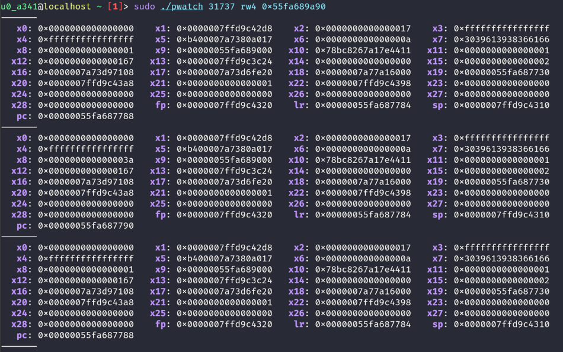

# pwatch

A cli tool to install a hardware breakpoint/watchpoint on a process in linux. This is useful for debugging a process without having to attach a debugger to it.

Now it supports x86_64 and arm64. You can use it on rooted Android devices as well.

## Usage

```
pwatch <pid> <type> <addr>
pwatch -t <tid> <type> <addr>
```
For example:
```bash
pwatch 31737 rw4 0x55fa689a90
```
This will install a read/write 4 byte watchpoint on the address `0x55fa689a90` of all threads in the process with pid `31737`.

## Output

